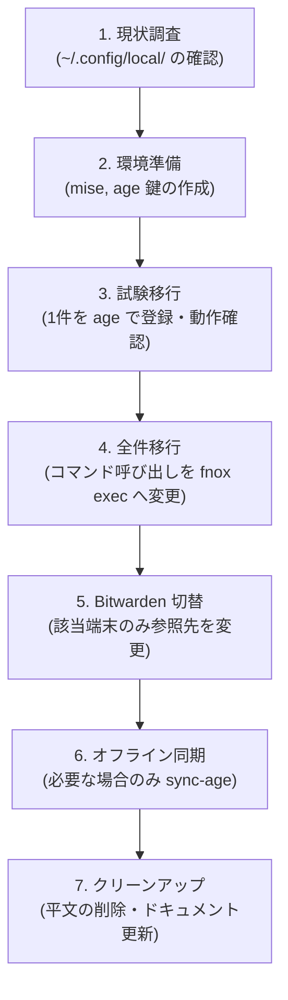

# fnox による秘密情報の管理設計

## 概要と目的

本ドキュメントは、端末内の `~/.config/local/` に平文で保存されているアクセストークンなどの個人用秘密情報を、シークレットマネージャ [fnox](https://fnox.jdx.dev/) を用いて安全に参照・管理する構成への移行方針を定めた設計書です。

### 移行のゴール

- **平文管理の撤廃**: `~/.config/local/` などの平文ファイルに直接秘密情報を置かない構成にする。
- **統一されたアクセスインターフェース**: 端末ごとに管理元（Bitwarden または age）が異なっても、呼び出し側（コマンドやスクリプト）は同一の秘密情報名で参照できるようにする。
- **リポジトリの安全性**: 暗号文を含め、秘密情報そのものは dotfiles リポジトリで管理せず、ツールの定義と運用手順のみを管理する。

### 対象範囲

- **対象**: 各開発端末全体で使用する個人用の秘密情報（API トークンやアクセストークンなど）。
- **対象外**:
  - プロジェクト固有の秘密情報（リポジトリ単位の `fnox.toml` で管理）
  - CI/CD パイプライン
  - Bitwarden Secrets Manager（本設計では Password Manager を使用）
  - `~/.config/local/` 内の秘密情報以外の独自設定（環境変数や端末固有スクリプトなど）

---

## 背景とアーキテクチャ

### 現状と課題

現状の dotfiles では、`dotfiles/tools/mise/conf.d/env.toml` で `DIR_LOCAL_CONFIG` を `~/.config/local` に設定しており、シェルの省略入力などからも参照されています。
しかし、このディレクトリ配下にトークンなどの機密情報が平文で保存されている場合、ファイル誤共有やバックアップ流出などのセキュリティリスクが生じます。

### fnox の設定読み込み仕様

fnox は、カレントディレクトリから親ディレクトリへ遡って設定を探索するとともに、ユーザー単位の設定（`~/.config/fnox/config.toml`）を常にグローバル設定として読み込みます。
そのため、作業ディレクトリを問わず日常的に個人用シークレットを利用するには、リポジトリ単位ではなく **端末ごとのユーザー設定（`~/.config/fnox/config.toml`）** に provider や secret を定義する必要があります。

```text
呼び出し元コマンド (fnox exec -- <cmd> / fnox get <SECRET>)
    │
    ▼
ユーザー単位設定 (~/.config/fnox/config.toml)
    ├── Bitwarden を利用する端末 ──> bw CLI ──> Bitwarden (Password Manager)
    └── Bitwarden を利用しない端末 ──> age ──> 端末内の暗号文 (~/.config/fnox/config.toml)
```

---

## 端末ごとの設定方針

設定ファイル（`~/.config/fnox/config.toml`）および鍵ファイルは Git 管理対象外とし、端末ごとにローカルで設定します。

### 1. Bitwarden を利用しない端末 (ローカル age 暗号化)

ローカルマシン固有の鍵（age）を用いて、設定ファイル内に直接暗号化された値を保持します。

#### 設定例 (`~/.config/fnox/config.toml`)

```toml
env = "exec"

[providers.local]
type = "age"
recipients = ["age1..."] # その端末の公開鍵
key_file = "~/.config/fnox/age.txt"
```

#### 秘密情報の登録手順

```sh
# 対話プロンプト（入力非表示）から値を安全に登録
fnox set SECRET_NAME --global --provider local
```

> [!WARNING]
>
> - `--global` を省略すると、カレントディレクトリのプロジェクト設定へ書き込まれる恐れがあります。
> - `--provider local` を省略すると既定で平文として保存されるため、必ず provider を指定してください。引数に直接シークレット値を渡さず、対話入力を使用します。

---

### 2. Bitwarden を利用する端末 (Bitwarden 参照)

Bitwarden Password Manager 内のアイテムを参照先として設定します。

#### 設定例 (`~/.config/fnox/config.toml`)

```toml
env = "exec"

[providers.bitwarden]
type = "bitwarden"

[secrets]
GITHUB_TOKEN = { provider = "bitwarden", value = "GitHub Token/password" }
```

※ `value` には「アイテム名/フィールド名」（パスワード項目の場合は `/password`）を指定します。

#### 認証とセッション管理

利用時は `bw` CLI でログインし、シェルセッション内でロックを解除します。

```sh
bw login
export BW_SESSION="$(bw unlock --raw)"
```

> [!CAUTION]
> `BW_SESSION` は dotfiles や永続化ファイルには保存せず、メモリ上（現在のシェルプロセス）のみで保持してください。
> Bitwarden 側でアイテムを更新した場合は、必要に応じて `bw sync` を実行してローカルキャッシュを同期します。

---

### 3. オフライン環境への対応 (Bitwarden 利用端末)

Bitwarden を利用する端末でオフライン環境でも作業を行いたい場合は、フォールバック用の age provider (`sync-age`) を併用し、事前にシークレットを暗号化キャッシュとして同期します。

#### 追加設定 (`~/.config/fnox/config.toml`)

```toml
[providers.sync-age]
type = "age"
recipients = ["age1..."]
key_file = "~/.config/fnox/age.txt"
```

#### 同期コマンド

```sh
# dry-run で同期対象を確認
fnox sync --global --provider sync-age --source bitwarden --dry-run

# 実際に同期してローカル設定に暗号文をキャッシュ
fnox sync --global --provider sync-age --source bitwarden
```

> [!NOTE]
> `fnox sync` を行うと各シークレットの `sync` フィールドに暗号化された値が保存され、以降の読み出し時は同期済みの値が優先されます。
> Bitwarden 側で値を変更した際は、`fnox sync --global --provider sync-age --source bitwarden --force` で強制再同期を行う必要があります。

---

## 利用方法とツール管理

### ツールの管理

- `fnox` は `dotfiles/tools/mise/conf.d/tools.toml` に追加して宣言的に管理します。
  - `mise use -g fnox` はリポジトリ管理外のローカル状態を直接更新してしまうため使用しません。
- Bitwarden 利用端末では `bw` CLI、age 鍵生成には `age-keygen` が必要です。

### コマンド実行時のシークレット解決

シークレットが必要なコマンドは、環境変数を注入する `fnox exec` 経由で起動します。

```sh
# コマンド実行時にのみ環境変数としてシークレットを渡す
fnox exec -- <command>
```

- シェルセッション全体へ常にシークレットを展開することは避け、`env = "exec"` 設定を基本とします（シェル統合は原則不要）。
- 単一の値のみを出力して確認したい場合は `fnox get SECRET_NAME` を使用できますが、ターミナル出力やコマンド履歴への映り込みに留意してください。
- 実験的なプラグインである `mise-env-fnox` は現時点では採用しません。

---

## 移行手順

所有者が各端末上で以下の手順に沿って段階的に移行します。



1. **現状調査**
   - 端末上の `~/.config/local/` を確認し、平文で定義されているシークレット、読み込み元のシェル設定、非秘密情報の設定を洗い出す。
   - ※この段階では値をメモ・記録せず、キー名と呼び出し元のみを把握する。
2. **環境のセットアップ**
   - `dotfiles/tools/mise/conf.d/tools.toml` に `fnox` を追加し、インストールする。
   - `mkdir -p ~/.config/fnox` を作成し、`age-keygen -o ~/.config/fnox/age.txt` で鍵ペアを生成する（権限は `chmod 600` を設定。既存鍵がある場合は上書きしない）。
   - 公開鍵は `age-keygen -y ~/.config/fnox/age.txt` で確認する。
3. **1 件での試験移行**
   - `~/.config/fnox/config.toml` に age provider を設定し、`fnox set GITHUB_TOKEN --global --provider local` などで登録する。
   - 任意のディレクトリから `fnox config-files` で設定が読み込まれていることを確認し、`fnox exec -- sh -c 'test -n "$GITHUB_TOKEN"'` など値を出力させない方法で検証する。
4. **残りのシークレットの移行と呼び出し元の更新**
   - 残りのシークレットを登録し、対象コマンドの実行方法を `fnox exec` 経由に置き換える。
   - 動作が確認できたシークレットから順に、`~/.config/local/` 内の平文定義を削除する。
5. **Bitwarden 端末の管理元切り替え**
   - Bitwarden を利用する端末では、Vault にアイテムを登録し、設定ファイルの provider を Bitwarden 参照に切り替える。
   - 正常に取得・実行できることを確認した後、旧 age 定義を削除する。
6. **オフライン同期の検証（必要な端末のみ）**
   - `sync-age` を設定し、dry-run を経て `fnox sync` を実行する。
   - ネットワークを切断した状態で正常にシークレットが参照できることを確認する。
7. **クリーンアップ**
   - `~/.config/local/` に移行対象の秘密情報が残っていないことを確認する（非秘密情報が残っている場合は `DIR_LOCAL_CONFIG` とシェルの省略入力を維持する）。
   - 確定した運用に合わせて `README.md` / `README-ja.md` およびドキュメントを更新する。

---

## セキュリティ対策と完了条件

### セキュリティ上の注意点

- **Git 管理の禁止**: `~/.config/fnox/config.toml`、age 鍵（`age.txt`）、暗号文キャッシュは絶対に Git 管理しない。
- **鍵ファイルのアクセス権限**: `~/.config/fnox/age.txt` には `chmod 600` を付与し、所有者のみが読み取れるようにする。
- **ログ・履歴の漏洩防止**: シークレットの値をコマンドライン引数、シェル履歴、ログ、コミット差分に含めない。
- **age 単体利用の前提理解**: 同一マシン上に暗号文と秘密鍵が共存する場合、OS への侵入者に対しては保護できない。この構成の主目的は「リポジトリ混入の防止」「平文ファイルの放置防止」「バックアップ時の平文漏洩防止」である。

### 完了条件チェックリスト

- [ ] カレントディレクトリを問わず、対象端末で必要な秘密情報が `fnox` 経由で解決できる。
- [ ] シークレットを必要とする主要なコマンドが `fnox exec` 経由で正常に動作する。
- [ ] Bitwarden 利用端末では Bitwarden を管理元とし、非利用端末では age により安全に取得できる。
- [ ] オフライン同期が必要な端末において、ネットワーク未接続時でもシークレットが解決できる。
- [ ] `~/.config/local/` から対象の平文定義が完全に削除されている。
- [ ] 鍵ファイルおよびユーザー単位の設定が Git 管理に含まれていない。

---

## 参考資料

- [fnox 公式ドキュメント: Configuration](https://fnox.jdx.dev/reference/configuration.html)
- [fnox 公式ドキュメント: Hierarchical Config](https://fnox.jdx.dev/guide/hierarchical-config.html)
- [fnox 公式ドキュメント: age Provider](https://fnox.jdx.dev/providers/age.html)
- [fnox 公式ドキュメント: Bitwarden Provider](https://fnox.jdx.dev/providers/bitwarden.html)
- [fnox 公式ドキュメント: fnox set](https://fnox.jdx.dev/cli/set.html)
- [fnox 公式ドキュメント: fnox sync](https://fnox.jdx.dev/cli/sync.html)
- [fnox 公式ドキュメント: mise Integration](https://fnox.jdx.dev/guide/mise-integration.html)
