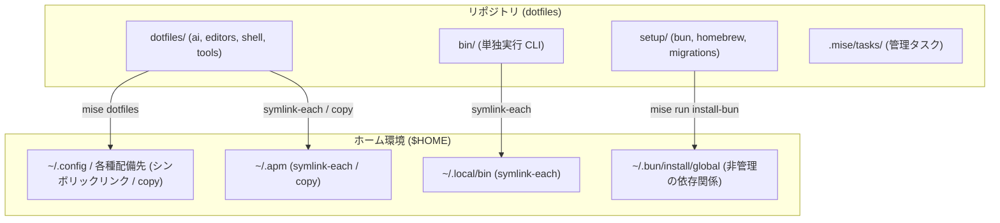

# アーキテクチャ

## 目的

日常的に使用するローカル開発環境を新しいマシンでも再現可能にするための dotfiles リポジトリです。各種ツールの設定ファイル、セットアップスクリプト、CLI コマンド、管理タスク、AI ツールの設定を一元的に管理します。

## 文書の役割

- `README.md`
  - ユーザー向けのセットアップ手順と日常的な運用
- `AGENTS.md`
  - エージェント向けのリファレンスと案内
- `docs/README.md`
  - リポジトリ全体および各サブシステムのドキュメント目次
- リポジトリ直下の `docs/`
  - リポジトリ全体の設計方針と運用ポリシー
- 各サブシステムの `docs/`
  - 各実装に特化した設計方針と運用ルール

コーディングエージェントは `AGENTS.md` を起点に `docs/README.md` を参照し、目次から対象のドキュメントを選択します。サブシステム固有のドキュメントについては、各サブシステム配下の `docs/README.md` を目次として参照します。

## 主要ディレクトリ

- `dotfiles/`
  - mise の `[dotfiles]` 宣言によりホームディレクトリへリンクする設定群
  - `ai/`、`editors/`、`shell/`、`terminal-apps/`、`tools/` に分類
- `bin/`
  - `~/.local/bin` へ公開する単独実行コマンド
- `libexec/`
  - 公開コマンド間で共有する非公開の補助スクリプト
- `setup/`
  - 環境構築用の Homebrew / Bun の構成定義およびスクリプト
  - `migrations/` には、宣言的なリンクだけでは扱えないデータ移行処理を配置
- `.mise/tasks/`
  - mise 経由で実行するリポジトリ管理タスク
  - 単機能のタスク定義は TOML ファイル、複数行にわたるシェルスクリプトはファイルタスクとして分離
- `tests/`
  - 一時的なホームディレクトリと実バイナリを用いて検証する Go の結合テスト

`node_modules/` や `apm_modules/` などの生成物はリポジトリ内に保持せず、Bun は `~/.bun/install/global`、apm は `~/.apm` にそれぞれ生成します。

## 設計原則

### 対象ごとにまとめる

設定を探す際に配備先のディレクトリ構造をたどる必要がないよう、同一対象の設定ファイルは 1 箇所にまとめます。たとえば Neovim の設定は `dotfiles/editors/nvim/`、Zsh の設定は `dotfiles/shell/terminal/` に配置します。また、Bun のセットアップ用ファイルは `setup/bun/` に置き、ホームディレクトリへリンクする設定と明確に区別します。

ホームディレクトリや macOS の `Library/` との対応関係は、`mise.toml` および `mise.macos.toml` の `[dotfiles]` セクションで明示します。配備先パスから逆算して配置を決めるのではなく、関連する設定を 1 箇所でまとめて編集できることを優先します。

### リンク設定とセットアップ処理を分ける

- 通常のシンボリックリンクは mise の `[dotfiles]` に宣言する
- OS 固有のリンク宣言は、OS 別設定ファイル (`mise.macos.toml` など) に分離する
- OS 固有のツール導入や環境変数は、mise の `os` 条件または OS 別設定に分ける
- 既存ファイルを保護したいディレクトリの配備には `symlink-each` を用いる
- Homebrew や Bun の構成定義および導入スクリプトは `setup/` 配下に配置する
- 宣言的なリンクだけでは対応できない過去データの移行処理は `setup/migrations/` に配置する

mise とは別に独自の一覧ファイルやリンク管理テーブルを持つことはしません。通常のリンク作成は mise の責務とし、本リポジトリ独自の処理は必要なデータ移行に絞ります。詳細は [mise bootstrap 設計](./bootstrap-design.md) を参照してください。

### ツールが期待する標準の配置を崩さない

`mise.toml`、`mise.lock`、`hk.pkl`、`go.mod` など、各ツールがリポジトリルートから読み込むファイルは移動しません。mise のタスク定義も標準の探索先である `.mise/tasks/` に配置します。ルートディレクトリのファイル数を減らすためだけに独自ディレクトリへ退避し、実行時の引数やオプションを増やすような構成は避けます。

### 公開コマンドと内部処理を明確に分ける

- 初回セットアップには `mise bootstrap` を用いる (`mise run install` は互換性のためのエイリアス)
- 日常利用する CLI ツールは `bin/` から `~/.local/bin` へ公開する
- 親シェルの環境変更 (カレントディレクトリ移動など) が必要な処理のみをシェル関数として残す
- 複数の用途で共通して利用する補助スクリプトは、必要になった時点で `libexec/` 直下に抽出する
- 特定の用途に限定された内部処理は、`libexec/` 配下の個別ディレクトリまたは呼び出し元に近い場所に配置する

### 固有のルールは実装の近くに配置する

複数サブシステムで共有する大原則は `docs/` に集約し、各サブシステム固有のルールは実装の近くで管理します。たとえば、省略入力の共通文法は `docs/abbreviation.md` で定義し、Neovim 固有のキーバインドやタブ表示方針は `dotfiles/editors/nvim/docs/` で管理します。共通部分を二重管理せず、関連ドキュメント同士を相互リンクでつなぎます。

### 生成物やユーザーデータをリポジトリで追跡しない

設定の宣言ファイルと lock ファイルのみをリポジトリで管理し、インストール結果の生成データやキャッシュはすべてホームディレクトリ側に配置します。移行処理を実行する際も、本リポジトリが作成したと特定できるファイルやシンボリックリンクのみを対象とします。
