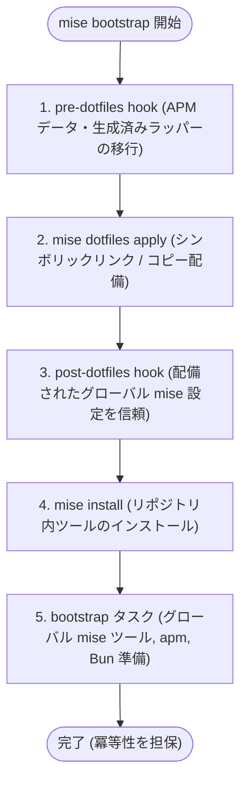

# mise bootstrap 設計

## 目的

dotfiles の通常のリンク配備には mise の標準機能を採用します。本リポジトリのコードでは、mise のみでは対応できないデータ移行とツールチェーン依存関係の準備に専念します。

## 役割分担

| 役割                             | 管理場所                                         |
| -------------------------------- | ------------------------------------------------ |
| 共通の dotfiles 宣言             | `mise.toml` の `[dotfiles]`                      |
| macOS 固有の dotfiles 宣言       | `mise.macos.toml` の `[dotfiles]`                |
| 共通のグローバル mise 設定       | `dotfiles/tools/mise/` の共通設定                |
| macOS 固有のグローバル mise 設定 | `dotfiles/tools/mise/config.macos.toml`          |
| 配備前に必要なデータ移行         | `setup/migrations/`                              |
| 配備後のツールや依存関係の導入   | `mise.toml` の bootstrap タスク                  |
| Homebrew 依存関係の導入と更新    | `mise.macos.toml` の `install-brew` と `upgrade` |
| 配備と移行の結合テスト           | `tests/` の Go テスト                            |

初回セットアップには `mise bootstrap` を使用します（`mise run install` は同一の処理を呼び出す互換エイリアスです）。mise とは別に独自の一覧ファイルやリンク管理テーブルを保持せず、`apply`、`status`、`unapply` などの操作も独自実装せずに mise の標準機能に委ねます。

## 配備モード

単独のファイルや、ディレクトリ全体をまとめて管理する設定は通常のシンボリックリンクにします。

`~/.local/bin` や `~/.apm` のように他のツールと共有するディレクトリでは `symlink-each` を採用し、管理外の隣接ファイルを安全に残します。

配備先のツールが実ファイルを直接書き換える場合は `copy`、リポジトリ側でのみ編集する場合はシンボリックリンクを使用します。たとえば `~/.apm` では、`symlink-each` の対象から `apm.lock.yaml` を除外した上で同じファイルを `copy` として宣言し、`apm_modules/` などの生成物は管理対象に含めません。

## 競合の扱い

mise の標準的な競合解決方針を次のように採用します。

- 宣言内容と一致している既存リンクは変更しない
- 配備先が存在しない場合は新たにリンクを作成する
- 既存の通常ファイルや実ディレクトリが存在する場合は競合とみなし、上書きせずに保護する
- 既存のシンボリックリンクの向き先が異なる場合は、宣言された配備元を指すように更新する
- `symlink-each` 配備先のディレクトリ内に存在する、管理外のファイルやリンクは削除しない

通常の配備は mise の標準動作に委ね、mise の管理外にあるリンクを独自に判定・保護するような余分な処理は行いません。一方、配備前にデータを移動する migration スクリプト（pre-dotfiles hook）では、本リポジトリが作成したと確実に判定できるリンクのみを変更対象とします。

## 状態管理

mise はすべての配備先を一元的に記録しているわけではありません。`symlink-each` で作成されたリンクのみが `$MISE_STATE_DIR/dotfiles` に記録されます。そのため、`[dotfiles]` の宣言を削除する際は、先に管理対象のリンクを解除しておく必要があります。この手順を踏めない場合に備え、本リポジトリが作成したと特定できるファイルのみを安全に処理する migration スクリプトを用意します。

配備を一時的に解除する場合も `mise bootstrap dotfiles unapply` を使用します。このコマンドは、現在の宣言とファイルの状態から mise が管理中と判定できる対象のみを安全に削除します。通常のシンボリックリンクは宣言された配備元を指している場合に限り削除し、`symlink-each` の配備先では管理外のファイルやリンクをそのまま残します。また、`copy` で配備したファイルの内容が配備元と異なっている場合は、ユーザーの変更を保護するために操作全体を中止します。

`unapply` が解除するのは dotfiles のリンク配備のみです。bootstrap タスクによってインストールされた mise のツール本体、apm の生成データ、Bun のパッケージなどは削除されません。なお、hk によるグローバルな Git hook 設定は `.gitconfig` の中に含まれているため、`.gitconfig` の配備を解除すると hook も自動的に無効化されます。

状態確認、dry-run、適用、配備解除に用いるコマンドの詳細は、[運用と確認](./operations.md) を参照してください。

## bootstrap の実行順序

1. pre-dotfiles hook で APM データと生成済みラッパーを移行する
2. mise が `[dotfiles]` の宣言に従ってリンクを配備する
3. post-dotfiles hook で、配備されたグローバル mise 設定のみを信頼する
4. mise がリポジトリで定義されたツールをインストールする
5. 共通の bootstrap タスクを実行し、グローバル mise ツール、apm、Bun を準備する

各処理は冪等性（何度実行しても同じ結果になること）を担保します。すでに移行が完了しているデータには手を加えず、本リポジトリが作成したと確認できないパスが存在する場合は安全のために移行を中断します。処理が途中で失敗した場合は、エラーメッセージを確認して原因を解消した後に `mise bootstrap` を再実行します。`--force` で競合を機械的に一括上書きする運用は、標準の手順とはしません。

初回セットアップ時は、公式インストーラで standalone 版 mise を導入した後に `~/.local/bin/mise trust`、`~/.local/bin/mise bootstrap --yes` の順に実行します。post-dotfiles hook は、信頼済みのリポジトリから配備されたグローバル mise 設定のみを後続処理のために信頼対象へ追加します。

Homebrew のパッケージ導入は bootstrap の一連の処理には含めません。Brewfile のパッケージは、macOS 環境において明示的に `mise run install-brew` または `mise run --continue-on-error upgrade` を実行して管理します（Linux の `upgrade` には Homebrew の更新を含みません）。また、mise 本体は Brewfile では管理しません。グローバル設定で自動更新を有効にし、必要に応じて standalone 版の `mise self-update` で即座に更新できるようにします。これにより、標準のセットアップ処理が Homebrew の動作やネットワーク状態に左右されない構成となります。

## テスト方針

Go の標準ライブラリを用い、実際の mise コマンドや移行スクリプトを子プロセスとして実行する結合テストを用意しています。テスト実行時は `HOME` や移行スクリプトが参照する各種環境変数（`DIR_*`）を一時ディレクトリに向けるため、開発機の実環境を一切汚さずに検証できます。

主なテストシナリオは次のとおりです。

- 宣言されたシンボリックリンクの作成と、既存ファイルを保護する `symlink-each` の配備
- 変更が加えられたコピー先ファイルがある場合に配備解除を中止し、管理外の隣接ファイルを保護すること
- 既存の通常ファイルを上書きせず保護し、シンボリックリンクのみを宣言通りに更新すること
- 2 回連続で実行しても結果が変わらないこと（冪等性の検証）
- 共通設定と macOS 固有設定が正しく分離されていること
- APM および Bun の生成データ移行処理
- apm が lock ファイルを通常ファイルとして再生成した後の再配備
- apm による更新結果がリポジトリ内の lock ファイルへ正常に書き戻されること
- 本リポジトリが作成したと確認できない APM リンクの移行を安全に拒絶すること
- 生成済みラッパーのみを削除し、ユーザー作成のファイルを保護すること
- 公開コマンドのラッパーが、実在する拡張子なしのスクリプトを正しく参照していること

テストでは mise の内部ロジックを再実装するのではなく、実際の CLI コマンドを実行してファイルシステム上の最終結果を検証します。Go はテスト用ツールとして `mise.toml` で管理されていますが、dotfiles の配備や通常利用自体は Go に依存しません。
